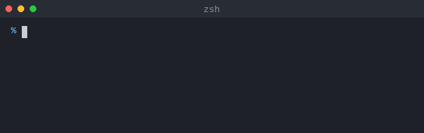

# ask-llm-cli

Describe what you want to do in plain English, get a shell command back. Powered by Claude.



It places the suggested command directly on your prompt line so you can review, edit, and press Enter to execute. The command is saved in your shell history.

## Prerequisites

- Node.js >= 18
- An [Anthropic API key](https://console.anthropic.com/) set in ASK_LLM_CLI_ANTHROPIC_API_KEY environment variable

## Installation

Install globally via npm:

```sh
git clone https://github.com/Element9/ask-llm-cli
cd ask-llm-cli
npm install -g
```

Add this function to your `~/.zshrc`:

```zsh
ask() {
  local cmd
  cmd=$(command ask-llm-cli "$@") || return
  print -z "$cmd"
}
```

Then reload your shell:

```sh
source ~/.zshrc
```

## Usage examples

```sh
ask find all TODO comments in this project
ask delete merged git branches
ask compress all PNGs in this directory
ask "show disk usage by directory"
```

Commands flagged as potentially dangerous by the model are shown with a warning.
